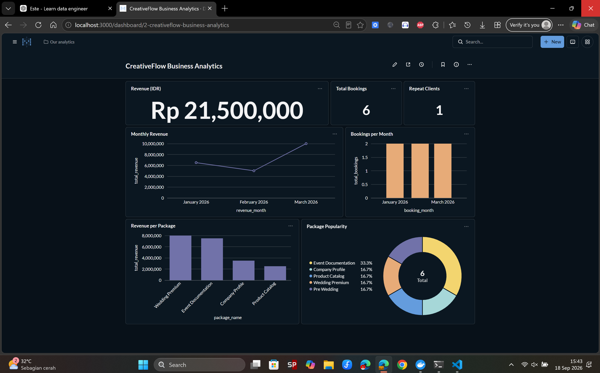
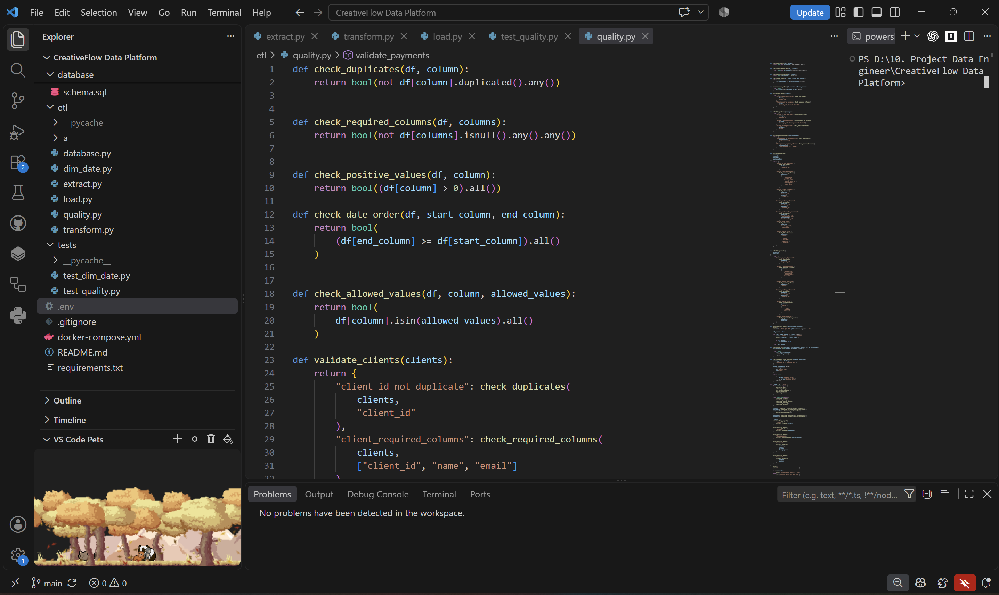

<div align="center">

# 📸 CreativeFlow Data Platform

### End-to-End Data Engineering Project for Creative Photography Business Analytics

<p>
A complete Data Engineering pipeline that transforms raw business data into a structured Data Warehouse and interactive Business Intelligence dashboard.
</p>



<br/>


</div>


---

# 📌 Overview

CreativeFlow Data Platform is an end-to-end Data Engineering project built for a photography business ecosystem.

This project demonstrates how raw operational data can be transformed into reliable analytical data through a complete data pipeline:

```
Raw Data (CSV)
        |
        ↓
Extract
        |
        ↓
Transform & Data Cleaning
        |
        ↓
Data Quality Validation
        |
        ↓
Load to Data Warehouse
        |
        ↓
Analytics Layer
        |
        ↓
BI Dashboard (Metabase)
```


The platform enables business users to analyze:

- Revenue performance
- Booking trends
- Package popularity
- Customer behavior
- Photographer utilization
- Business performance metrics


---

# 🎯 Project Objectives

The main objectives of this project are:

- Build a complete ETL pipeline from raw data sources
- Implement Data Warehouse architecture
- Apply Star Schema modeling
- Create reliable data quality validation
- Implement analytical SQL queries
- Build an interactive BI dashboard
- Containerize infrastructure using Docker


---

# 🏗️ Data Architecture



The platform follows an end-to-end Data Engineering architecture:
```
                 Raw Business Data
                       |
                       |
                  CSV Files
                       |
                       |
              +----------------+
              | Extract Layer  |
              +----------------+
                       |
                       |
              +----------------+
              | Transform     |
              | Data Cleaning |
              +----------------+
                       |
                       |
              +----------------+
              | Data Quality  |
              | Validation    |
              +----------------+
                       |
                       |
              +----------------+
              | PostgreSQL    |
              | Data Warehouse|
              +----------------+
                       |
                       |
          +--------------------------+
          |                          |
          ↓                          ↓

    SQL Analytics              Metabase Dashboard

```


---

# 🛠️ Tech Stack


## Programming

- Python 3.11
- Pandas
- SQLAlchemy


## Database

- PostgreSQL 16


## Data Engineering

- ETL Pipeline Development
- Data Transformation
- Data Quality Engineering
- Star Schema Modeling
- Surrogate Key Management
- Data Warehouse Design


## Infrastructure

- Docker
- Docker Compose


## Analytics & Visualization

- SQL Analytics
- PostgreSQL Views
- Metabase Dashboard


---

# 📂 Project Structure


```
CreativeFlow Data Platform

│
├── analytics
│   ├── queries.sql
│   └── views.sql
│
├── dashboard
│   └── creativeflow-dashboard.png
│
├── data
│   └── raw
│       ├── clients.csv
│       ├── packages.csv
│       ├── photographers.csv
│       ├── bookings.csv
│       └── payments.csv
│
├── database
│   ├── schema.sql
│   └── fact_schema.sql
│
├── etl
│   ├── extract.py
│   ├── transform.py
│   ├── quality.py
│   ├── load.py
│   ├── dim_date.py
│   └── database.py
│
├── tests
│   ├── test_quality.py
│   └── test_dim_date.py
│
├── docker-compose.yml
├── requirements.txt
└── README.md

```


---

# 🔄 ETL Pipeline


## 1. Extract

Raw business data is extracted from CSV files:

- Client data
- Package data
- Photographer data
- Booking data
- Payment data


Example:

```
clients.csv
bookings.csv
payments.csv
```


---

## 2. Transform

Data transformation includes:

- Data type normalization
- Date formatting
- Duplicate removal
- Data cleaning
- Field standardization


Example:

```
Raw Data

Phone:
08123456789


↓

Normalized Data

+628123456789

```


---

## 3. Data Quality Validation


Implemented automated validation framework:


### Data Integrity Checks

✅ Duplicate detection

✅ Required column validation

✅ Positive value validation

✅ Foreign key/reference validation

✅ Date consistency validation

✅ Allowed value validation


Example:

```
Booking Date <= Event Date

Payment Amount > 0

Booking Client ID exists in Client Dimension

```


Testing:

```bash
pytest tests/test_quality.py -v
```


Result:

```
10 passed
```


---

# 🗄️ Data Warehouse Design


The project uses Star Schema architecture.


## Dimension Tables


### dim_client

Stores customer information:

- Client ID
- Name
- Email
- Phone
- City


### dim_package

Stores photography packages:

- Package ID
- Package Name
- Category
- Price
- Duration


### dim_photographer

Stores photographer information:

- Photographer ID
- Name
- Specialization
- Experience


### dim_date

Date dimension for analytical time-based reporting.


---

## Fact Tables


### fact_booking

Stores booking transactions:

- Booking ID
- Client Key
- Package Key
- Photographer Key
- Booking Date
- Event Date
- Status


### fact_payment

Stores payment transactions:

- Payment ID
- Booking Key
- Payment Date
- Amount
- Payment Method
- Status


---

# 📊 Business Intelligence Dashboard


Dashboard created using Metabase.


Implemented analytics:


## Revenue Analytics

- Total Revenue
- Monthly Revenue Trend
- Revenue by Package


## Booking Analytics

- Total Booking
- Booking Trend
- Package Popularity


## Customer Analytics

- Repeat Customers
- Customer Booking Frequency


Dashboard Preview:


---

# 🚀 How To Run


## 1. Clone Repository

```bash
git clone https://github.com/sulthonarifimadudin/creativeflow-data-platform.git

cd creativeflow-data-platform
```


---

## 2. Install Dependencies


```bash
pip install -r requirements.txt
```


---

## 3. Start Database & Metabase


```bash
docker compose up -d
```


Check containers:

```bash
docker ps
```


---

## 4. Run ETL Pipeline


Extract:

```bash
python etl/extract.py
```


Transform:

```bash
python etl/transform.py
```


Data Quality:

```bash
python etl/quality.py
```


Load:

```bash
python etl/load.py
```


---

## 5. Open Dashboard


Access Metabase:

```
http://localhost:3000
```


---

# 🧪 Testing


Run all tests:

```bash
pytest -v
```


Current test coverage includes:

- Data quality validation
- Dimension date generation
- Referential integrity


---

# 📚 Data Engineering Concepts Implemented


✅ ETL Pipeline Development

✅ Data Warehouse Architecture

✅ Star Schema Modeling

✅ Surrogate Key Management

✅ Data Quality Engineering

✅ SQL Analytics

✅ BI Dashboard Development

✅ Containerized Data Infrastructure


---

# 👤 Author


**Sulthon Arif Imadudin**


AI Engineer | Data Engineer Enthusiast


GitHub:

https://github.com/sulthonarifimadudin


LinkedIn:

https://www.linkedin.com/in/sulthon-arif-imadudin-3a2919263/


---


⭐ If you find this project useful, feel free to explore and give feedback.